# Introduction

Prefy is an Android social platform that allows users to post two images and get other users to vote on which they prefer.
It supports full account management, commenting, following and so much more.

## Note from the developer

This project was made in 2023, and I am very proud of some of the [design and implementations](#feature-list).  
Since then, my abilities and styles have progressed significantly, and thus I have prepared a list of [improvements I would make](#improvements-i-would-make).

## Table of contents

- [Tech Stack](#tech-stack)
- [Images & Screenshots](#images--screenshots)
- [Feature List](#feature-list)
- [Designs & Improvements](#designs-and-improvements)
    - [Good Design Aspects](#good-design-aspects)
    - [Improvements I Would Make](#improvements-i-would-make)

## Tech Stack
- **Language:** Java, Kotlin
- **Architecture:** MVVM
- **Local Database:** SQLite (with caching)
- **Networking:** OkHttp
- **Image loading:** Glide
- **Other:** Firebase Remote Config, Crashlytics, AdMob

## Images & Screenshots

### Store images

  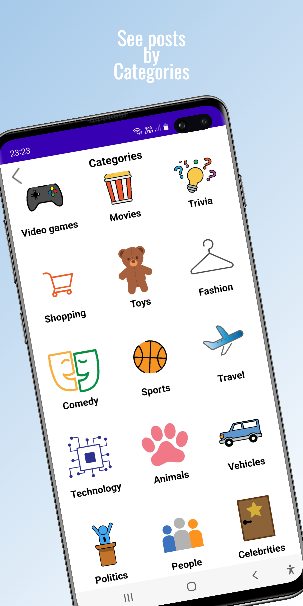
  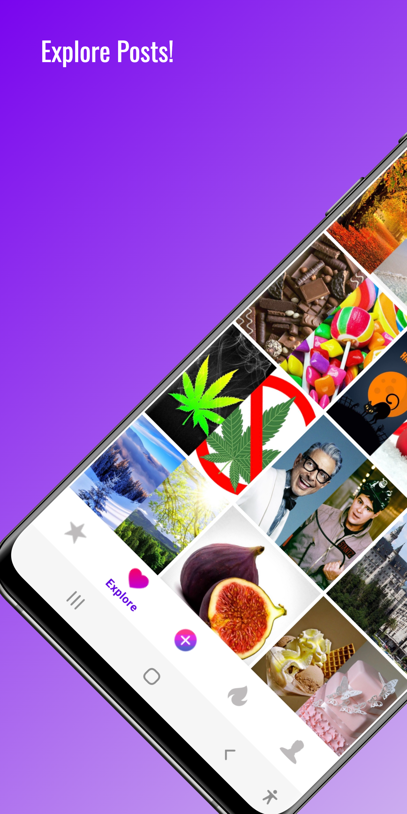
  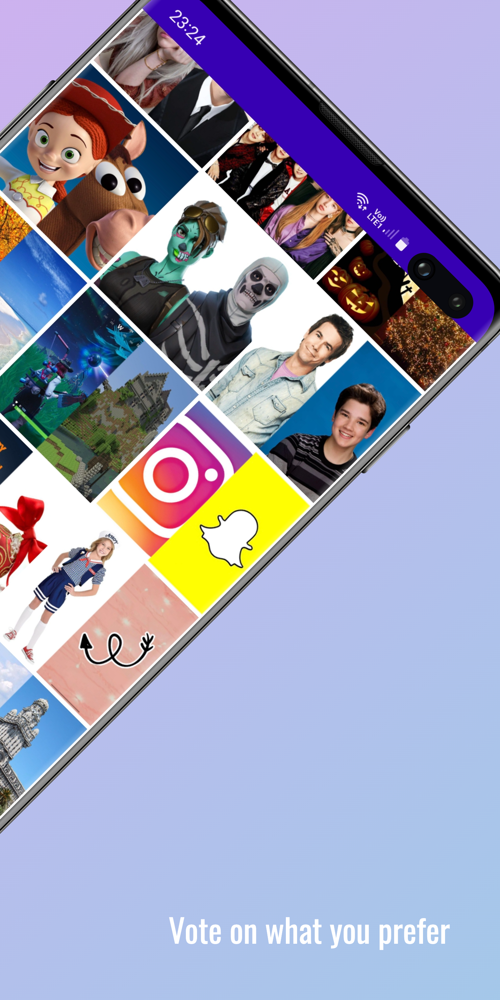
  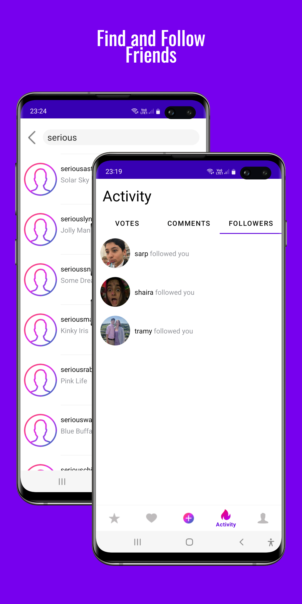
  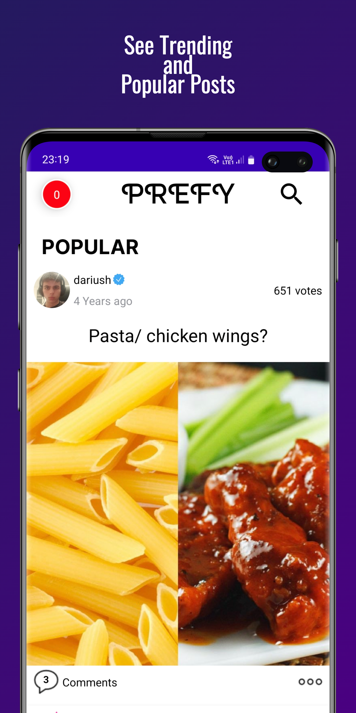
  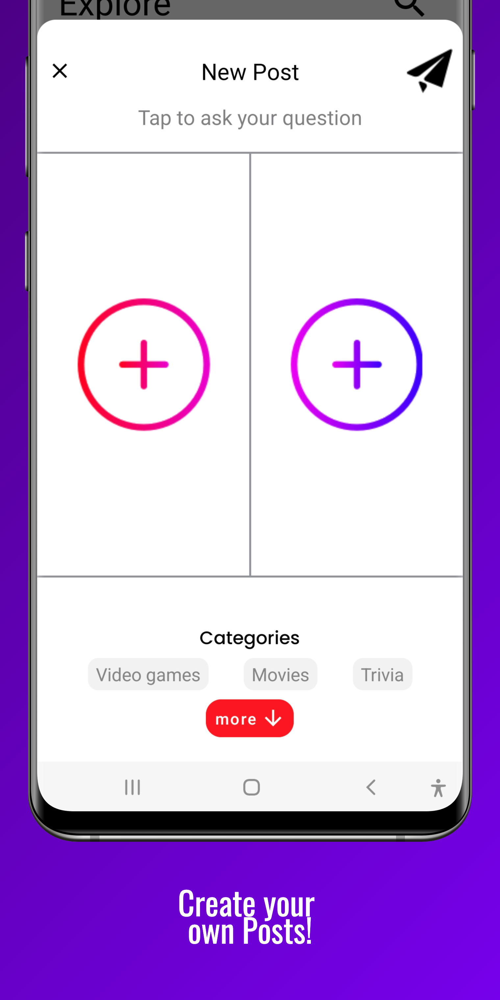

### App Screenshots

| Followers Activity | Categories | Comments | Dark Mode |
|:-----------------:|:----------:|:--------:|:---------:|
| 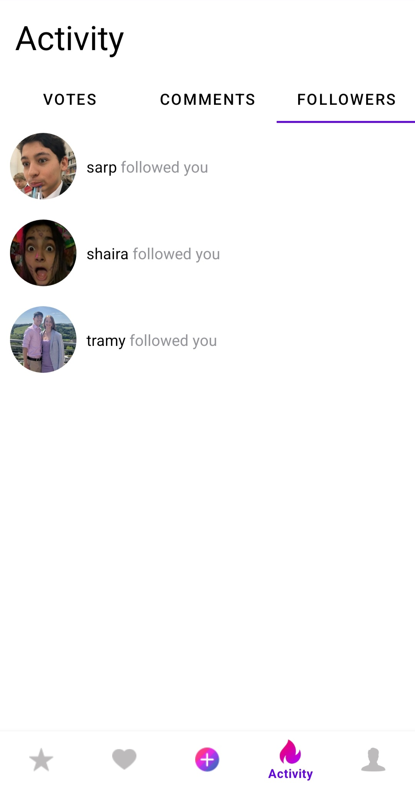 | 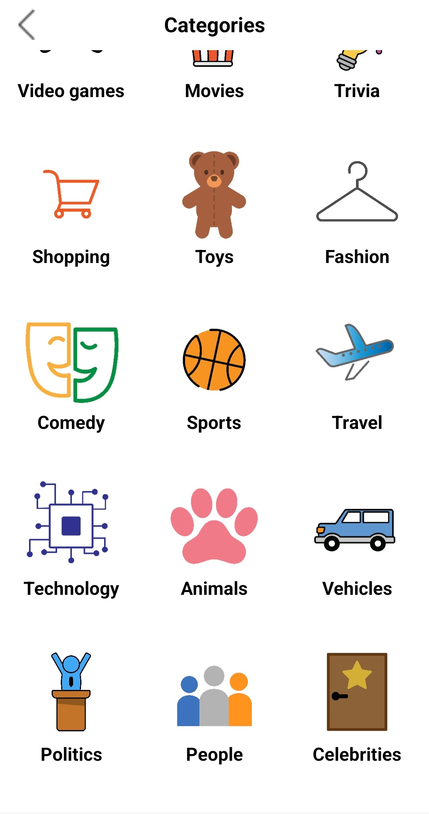 | 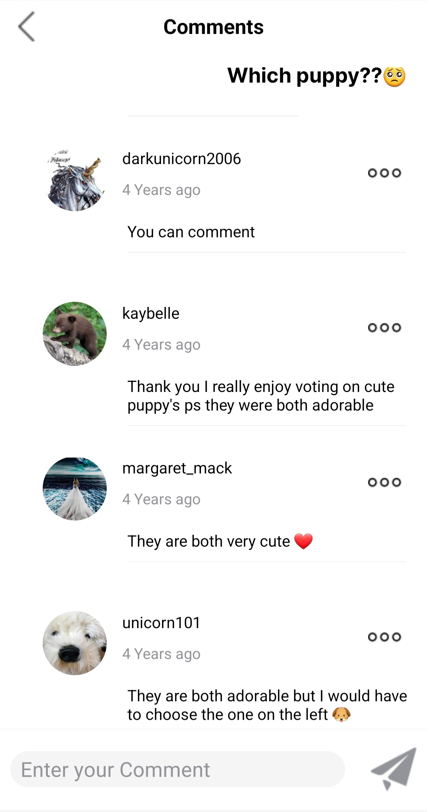 | 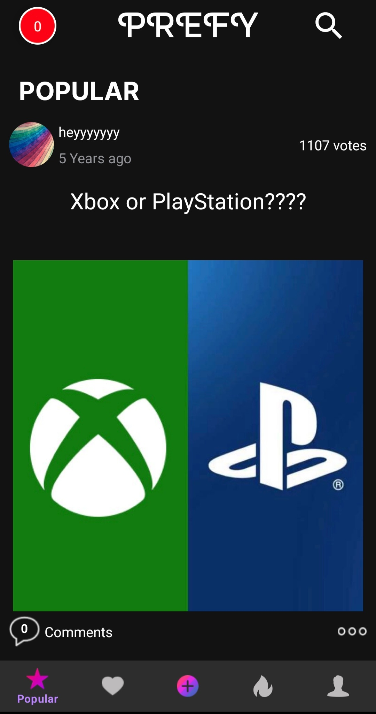 |
| See who has followed you recently | Browse and select categories | Comment on posts | App interface in dark mode |

| Explore Page | Popular Page |                      Post Creation                       | Search Page |
|:------------:|:-----------:|:--------------------------------------------------------:|:------------:|
| 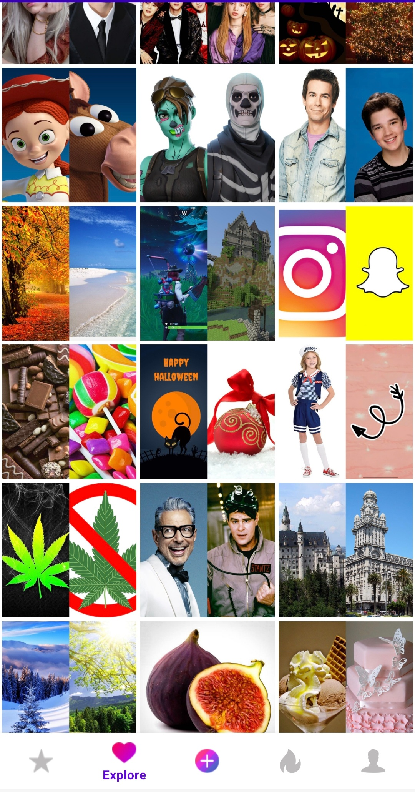 | 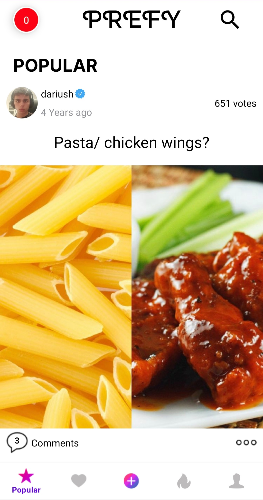 | 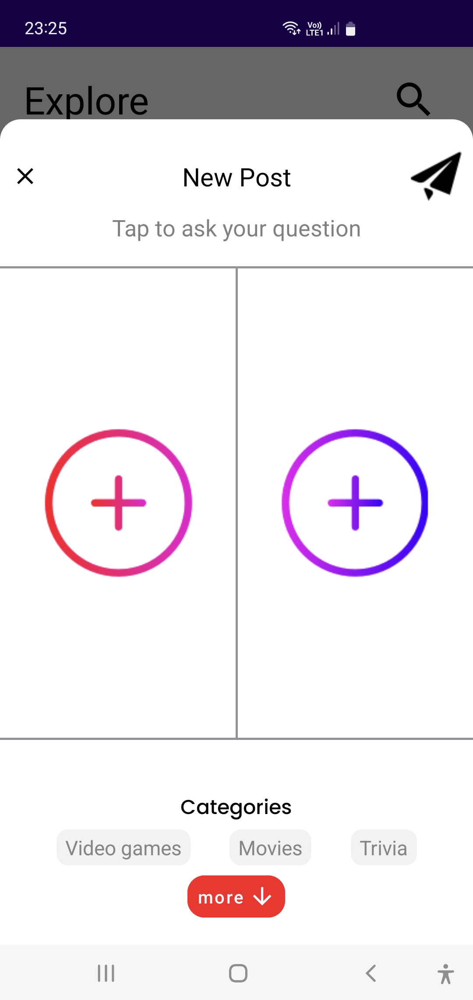 | 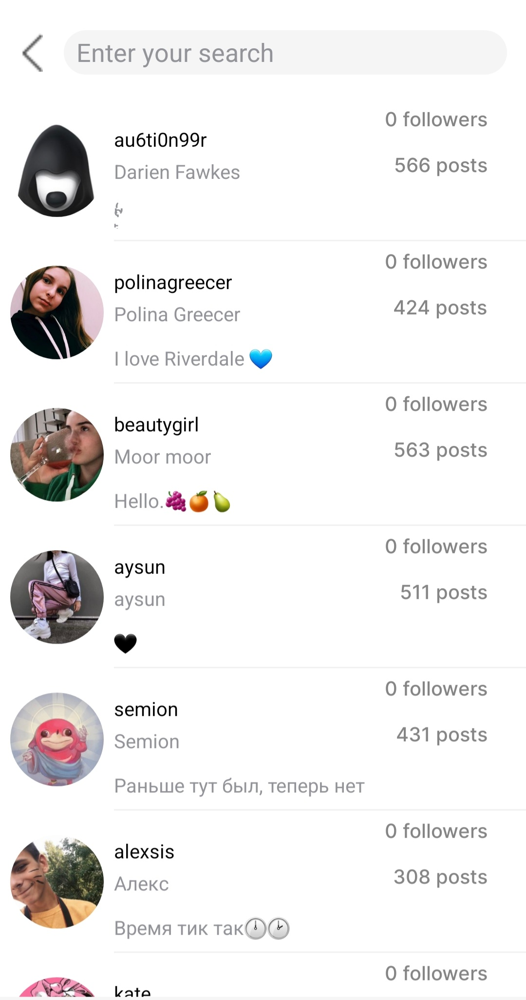 |
| Explore trending posts | View popular posts |                  Upload your own posts                   | Search for users or see top users |

## Feature list

- Posts where users can choose on two images to vote on which they prefer
- User accounts, with verified users, the ability to follow users etc
- Search feature to search for other users, and see a list of the top users on the platform
- Lots of customising options with dark mode, auto scroll, changing of password
- Categories of posts with the ability to choose and search through categories
- Featured posts for allowing paid promotion
- Popular posts which showcase trending content 
- Custom Animations including vote animations
- Activity list to see who has interacted with your or your posts.
- Full comment system on posts
- Interstitial ads to generate revenue
- GDPR compliant, user's have to be 13+ and ads have a gdpr consent form

## Design choices & Improvements

### Good Design aspects

#### Utilises MVVM architecture
In order to reduce unnecessary calls this application employs the MVVM architecture with the UI, the viewmodel and the repository.
Allows for live changing of data.

#### Firebase Remote Config
This application uses firebase remote config to allow for the dynamic altering of the server address/ ad frequency without having to update the app.

#### Local caching storage with SQL Lite
Uses local caching to store popular posts that the user hasn't seen and other details to create a seamless user experience,
where the user doesn't have to wait for them to load.

#### Crashlytics
Integrates crashlytics to allow the detection of crashes without requiring manual user submissions, which can help improve app stability.

#### Full handling of the Android Activity lifecycle
Uses the full handling of the android activity lifecycle including saving and restoring data when the application is destroyed/paused.
This creates a seamless UX experience.

#### Glide
Glide is used for efficient image loading and caching, reducing wait times and improving performance when displaying images.

#### Upload data thread
Uploaded data is first stored in database tables, and a separate thread processes and uploads this data in the background.
This allows for uploads in less requests and ensures updates can resume even after the app is reopened.
A possible improvement would be supporting uploads even when the app is closed.

#### Shared prefs
Shared Preferences are used to store user settings and lightweight data, such as dark mode preferences and profile information.

### Improvements I would make 

#### Testing
While a lot of manual testing was conducted, it would have been significantly better to use unit tests and instrument tests
for bugs that users may not find.

#### Code reuse
Through review of the code, there is a significant amount of boilerplate code that could easily be refactored. 
This is very prevalent with the recycler views and the executors for retrieving data. Using generics and polymorphism could
significantly reduce code.

## Project Outcome

While the number or downloads and recurring users was less than I hoped for and the app is no longer on the playstore
, I learnt quite a few things including:

- Android specific concepts
- Structuring apps with the MVVM architecture
- The importance of user architecture and marketing
- Designing a system while keeping in mind authentication, user generated-content

So, overall I would consider this a success.